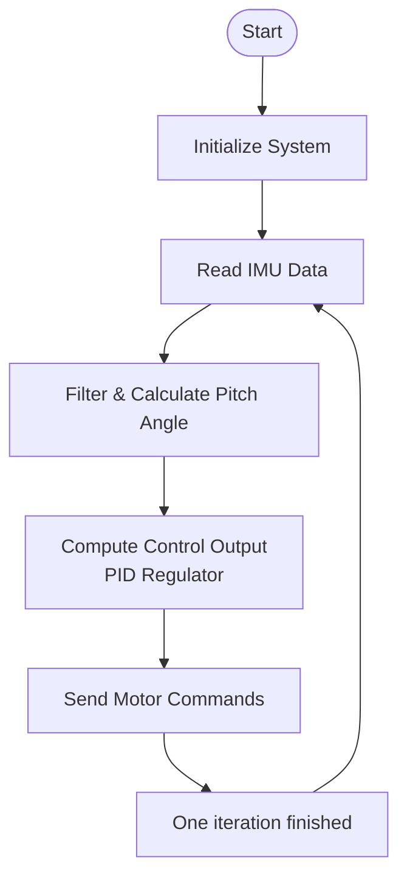
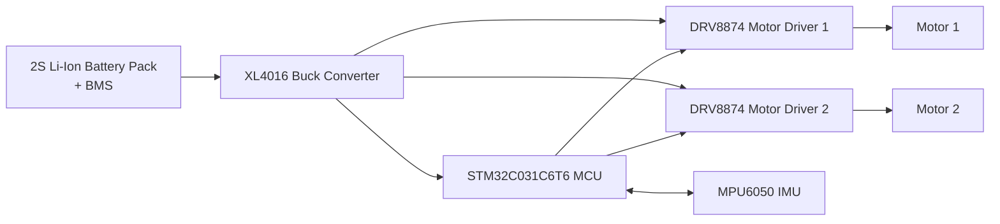

# Auto balancing robot

The goal of this project is to design and implement a small two-wheeled robot that maintains an upright position on its own by sensing its tilt angle and actively driving the wheels to correct for deviations. 
In control-theoretical terms this machine behaves like an inverted pendulum, a naturally unstable system that must be constantly regulated to stay balanced.

## Hardware components

**Actuators**: 2x 6 VDC gear motors, 280 rpm - These provide the torque necessary to drive the robot’s wheels. The rotational direction and speed of these motors are adjusted rapidly to push the robot forward or backward and counteract its tendency to tip over.

**Motor driver**: 2x DRV8874 motor driver -  A compact H-bridge driver that can control two separate motors in both forward and reverse directions. It takes PWM signals and direction inputs from the microcontroller to regulate motor voltage and consequently wheel speed.

**Inertial Measurement Unit (IMU)**: MPU6050 (3-axis gyroscope + accelerometer) -  Measures angular velocity and acceleration. By combining these measurements, the system estimates the robot’s tilt relative to vertical. 
This information is essential for the robot to compute how far and how quickly the wheels need to move to maintain balance.

**MCU**: STM32C031C6T6 - Main controller of the robot. Reads the IMU over I²C, runs the real-time control loop (balance algorithm), and generates PWM/direction signals for the motor drivers. 
Chosen for low cost, good peripherals (timers/PWM, I²C, interrupts), and solid tooling (STM32CubeIDE).

**Power system**: 2S Li-ion cells, total nominal ~7.4 V (max 8.4 V) + BMS - The primary energy source of the robot. The Battery Management System (BMS) ensures safe operation by protecting against overcharge, overdischarge, overcurrent, and short circuits.

XL4016 DC-DC Step-Down (Buck) Converter - Converts the battery voltage to stable lower voltage levels required by the electronics (e.g., logic supply for MCU and sensors). This ensures consistent system operation despite battery voltage variations during discharge.

## Software architecture

**RTOS**: The robot’s firmware is structured around FreeRTOS, a real-time operating system kernel for microcontrollers. This allows the software to run multiple tasks concurrently with deterministic timing — for example:
- Sensor acquisition task
- Control loop task
- Motors steering task
- PID regulator task
- System monitoring task

Using FreeRTOS helps keep time-critical loops (like balance control) isolated from less critical background processes.

**Peripheral Drivers**: All hardware abstraction and peripheral control are implemented as MCU drivers. These drivers provide:
- I2C to communicate with IMU sensor
- GPIO and Timers (PWM) to control motor drivers
- Initial MCU configuration (choose of system clock, FLASH memory latency etc.)

This ensures performance and portability across hardware.

**Application logic**: On top of the drivers, higher-level logic written in C++ interprets sensor data and makes real-time decisions. Responsibilities of this layer include:
- Combining gyro and accelerometer readings into a stable tilt estimate via complementary filter
- Running a control algorithm that computes the drive commands needed to correct tilt (PID regulator)
- Managing system states (balancing, startup calibration, fault conditions)

The main task repeatedly:
- Reads the current tilt from the IMU
- Computes how far the robot is leaning
- Calculates motor commands that will counteract that lean via PID regulator
- Sends PWM and direction updates to the motor driver

This task runs fast enough (once every 5 ms) to keep the robot stable against disturbances.

## Flowchart

## System diagram

    
